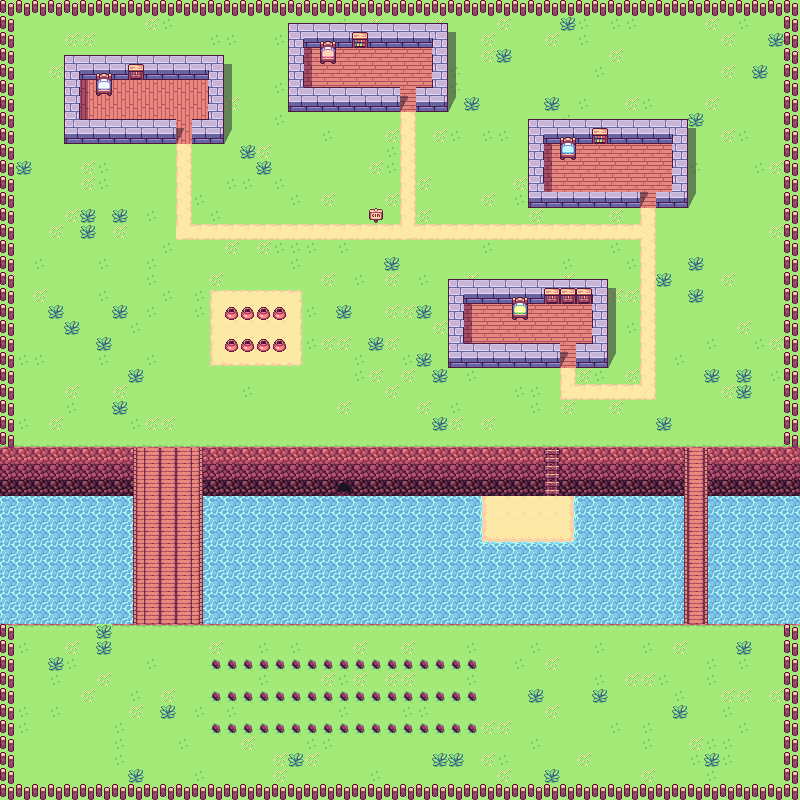

# GPTRPG

This repo contains two things:

* A simple RPG-like environment for an LLM-enabled AI Agent to exist in
* A simple AI Agent connected to the OpenAI API to exist in that environment

It is intended as a proof of concept.

## Running

GPTRPG is intended to be run locally. To run:

1. Make sure you have updated the `agent/env.json` file with your OpenAI API key.  
2. Only tested with node 16.19.0 
2. In the `gptrpg` directory run `npm install` to install dependencies for all projects.
3. Then run `npm start` in the root directory.  This will start the agent and the front-end.  The front-end will be available at `http://localhost:3000`.

## The Environment
Code for the environment lives in the `ui-admin` directory. It is a React project.

The environment was made with [Tiled](https://www.mapeditor.org/) map editor.  The files live in `ui-admin/src/assets`.

The environment is rendered with [Phaser](https://phaser.io/) and the [Grid Engine Plugin](https://annoraaq.github.io/grid-engine/)

The environment consists of:

* The character (agent)
* Impassable tiles
* A plant layer with "plantable" tiles, and plants (not currently in use by agent).  Player can plant food on plantable tiles with S key and harvest food with D key.

## The Agent
Code for the agent lives in the `agent` directory.

The agent is a simple AI agent that uses the OpenAI API to make decisions.  It communicates with the front-end via a websocket.

The agent is provided with a list of possible actions, the state of its surroundings, and its internal state (currently only sleepiness is measured).

## Upcoming features

* Multi agent support
* More agent actions (drink, eat, plant food, harvest food, write poetry, etc.)
* More agent states (hunger, thirst, etc.)
* Agent memory
* Agent goals
* Agent inventory
* Deployment to web
* Human controlled character
* UI enhancements (agent state, human interactions, etc.)

## Notes

Currently, GPTRPG runs with the `gpt-3.5-turbo` API.

